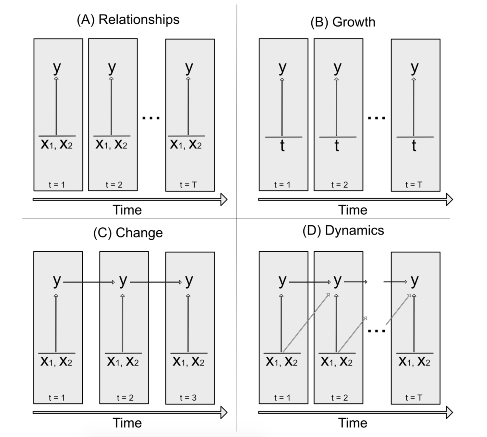

# Hook thoughts

## Hook from last meeting

### A "it is confusing and we would like to organize" argument
  
* New researchers are increasingly asked to collect longitudinal data. We care about longitudinal data.
* The longitudinal literature appears more confusing than it is because people propose different hypotheses, use different models, and make different inferences. 
* We organize and discuss the similarities.
  
## Bliese paper hook

### A "this other technique can augment what you are doing" argument

* We increasingly have access to longitudinal data that contain discontinuities.
* Examples.
* These studies use a variety of techniques to understand discontinuous patterns, but we believe that discontinuous growth models can augment existing techniques...
* Practical advice is spread across numerous sources and is basic -- we review.

## Aguinis paper hook

### A "this literature is technical and mathy, not accessible to org researchers" argument.

* We care about A or B.
* There is a large technical literature on A or B.
* Much of this work is not easily accessible to researchers with the usual methodological and statistical background obtained from doctoral level training in management.
* We provide recommendations.

## Thoughts from last meeting

### A no argument but describing paper

* We care about longitudinal data
* Our literature now contains a lot of cool examples and inferences
* We are going to describe them
* This paper is for newcomers who want some examples and for longitudinal modelers who want other options to augment what they are doing


Organizational researchers are increasingly interested in longitudinal data structures. These data align with the processes we study, which "are not static but instead develop, change, and evolve over time" (Pitariu & Ployhart, p. 405) or are "sequences of events that play out within each person's stream of experience" (Beal, 2015, p. 5). If researchers can collect longitudinal data, they are then in a better position to understand patterns over time. Bell and Kozlowski (2003), for example, state that "longitudinal designs...will be far more revealing of the team phenomeon under investigation" (p. 59). Similarly -- in their review of emotional labor -- Grandey and Gabriel (2015) suggest that future researchers may be much better equipped to demonstrate emotion regulation patters "with longitudinal methods" (p. 329). Not only do longitudinal data collections help researchers observe relationships over time, many argue that doing so helps improve our theories. For instance, Pitariu and Ployhart (2010) suggest that collecting longitudinal data, observing change, and testing dynamic models "stimulates greater refinement in our existing theories" (p. 411), and Grandey and Gabriel (2015) urge for greater theoretical development of emotions by studying their "reciprocal and unfolding...processes...through momentary assessments or lagged effects" (p. 322). These quotes reveal our field's emphasis on collecting longitudinal data to sufficiently observe a process and build better theory.

A greater emphasis on longitudinal data is also apparent in our empirical literature, where collecting repeated measures is now common. For instance, @jones2016 observed the work attitudes of pregnant women in their second trimester every week until they gave birth. @ritter2016 assessed job satisfaction across three time points that were each separated by six weeks. @matthews2014 studied work-family conflict across several months. @meier2013 examined counterproductive work behavior over five waves. @hardy2018 investigated self-regulation over 20 lab trials. @gabriel2014 measured fit and affect five times per day for 10 consecutive work days. Finally, @johnson2014 observed justice behavior and resource depletion across 10 consecutive workdays.

Armed with repeated observations, these studies then explore a variety of interesting inferences. @hardy2018 propose and find support for growth trends in self-regulation, metacognition, and performance. @jones2016 conclude that concealing behaviors among pregnant women lead to greater subsequent physical health. @johnson2014 establish that "justice is dynamic: The frequency of actors' justice behaviors varies day to day" (p. 10), and these daily fluctuations predict daily changes in depletion. Finally, @meier2013 suggest that the effects of work stressors on counterproductive work behaviors are not substantially different across different time lags. 

Moreover, we find different types of sophisticated modeling strategies throughout. @meier2013 present a sequence of path models that test increasingly longer time lags. @hardy2018 and @jones2016 employ bivariate cross-lagged latent growth curves, an approach similar to the latent change model used by @ritter2016. We also find complex hierarchical linear models in various event-sampling studies [e.g., @koopman2016; @rosen2016].  

In summary, our increasing theoretical emphasis on longitudinal data and its growing prevalence in our empirical literature has led to many interesting inferences and model applications. Researchers are beginning to propose hypotheses with lags and examine the reciprocal nature between two or more variables. Studies now commonly make inferences about change, growth, and dynamics. And sophisticated models, such as multi-level and latent growth curves, make their appearance in almost every longitudinal study.

We want to bring attention to this new and exciting literature. Specifically, in this paper we describe some of the common inferences and models researchers employ with longitudinal data, provide examples from our literature, point out the strengths and weaknesses of each approach, and discuss recommendations. Many of these studies appear unrelated due to the different language used among various content or statistical modeling areas -- but we believe our discussion will reveal some of their covert similarities. Our paper is meant for two audiences. First, we believe this summary will help any newcomers who want to make inferences with their longitudinal data but are unaware of what types of inferences and models are available. Second, this paper is meant to show seasoned researchers other possibilities -- other inferences and models that may augment how they currently approach longitudinal data. 

Below, we discuss four common inferences researchers make with longitudinal data: relationships over time, growth, change, and dynamics. These do not represent every possible domain we can explore with longitudinal data, but they do cover a large portion of the techniques currently employed in our literature. We begin by explaining what we mean by longitudinal research. We then unpack a framework proposed by Xu and DeShon that relates the four different research streams. In the core of the paper, we discuss each stream in depth, provide examples from the literature, point researchers to potential models, and acknowledge the pitfalls and limitations of each approach. 
    
# Intro

## Define longitudinal

This paper is exclusively devoted to the inferences we make with repeated observations, so we begin by identifying a few labels and definitions. Authors typically identify a "longitudinal" study by making a contrast with respect to either a) research designs or b) data structures. Longitudinal *research* is different from cross-sectional research because longitudinal designs entail three or more repeated observations (Ployhart & Bliese, Singer & Willett). We therefore emphasize differences on the number of observations when we distinguish longitudinal from other types of research. Longitudinal *data* are repeated observations on several units (i.e., $N$ or $i$ > 1), whereas panel data are observations of one unit over time -- a distinction that focuses on the amount of people in our study (given repeated measures). Most organizational studies collect data on more than one unit, therefore our discussion below focuses on longitudinal research with longitudinal data, or designs with $N$ > 1, $t$ >= 3, and the same construct(s) measured on (potentially) each $i$ at (potentially) each $t$. 

## Introduce framework

Presenting the entire inference and modeling literature that uses longitudinal data would be impossible. Instead, we focus on four related streams that we feel can be organized nicely using a framework proposed by Xu and DeShon. Figure one shows each inference we will discuss in this paper: relationships, growth, change, and dynamics. 

In each panel in figure one, time is on the $x$-axis to portray that we are investigating these inferences over time. Each slice contains an observation of $y$, such that at time $t$ we observe $y_{1}$ and at $t + 1$ we observe $y_{2}$. What differentiates the panels -- the inferences -- is the pattern of relationships we investigate -- and we add complexity as we move from $A$ to $D$. For example, researchers do not include lag effects when they are interested in relationships over time (panel $A$), but they do include a lag effect when they study change or dynamics (panels $C$ and $D$). We will devote a section to each of these inferences below, but we first describe some preliminary pieces about code and data that we repeatedly refer to in this paper. 



## Introduce data sets and generice variables

We will use two generic variables -- affect ($x$) and performance ($y$) -- throughout our discussions. These variables will hopefully provide continuity across the inferences and also provide an illuminating backdrop after we refer to $x$ or $y$ generically. Moreover, we use code examples in each section that refer to data sets that contain measures of affect and performance on 50 simulated subjects across five time points. 

These data are contained in two data sets: `long_df` and `wide_df`. The raw data are the same, but their formatting differs because different estimation techniques require different data structures. Structural equations modeling (SEM) requires wide data, whereas HLM requires long data. The first data set, `long_df` contain the data in long form, 

```{r, echo = F}

long_df <- data.frame(
  
  'affect' = c(rnorm(500, 10, 1)),
  'performance' = c(rnorm(500, 15, 5)),
  'id' = c(seq(from = 1, to = 50)),
  'time' = c(rep(1:10, each = 50)))

head(long_df)

library(reshape2)

wide_df <- reshape(long_df, idvar = 'id', timevar = 'time', direction = 'wide')

head(long_df[, -1])

```

\noindent where `id` refers to a person identifier, `time` refers to the observation period, and `affect` and `performance` each contain their own columns. 

The second data set, `wide_df` contain the data in wide form,

```{r, echo = F}
head(wide_df[, -1])
```

where `id` is defined above and now `affect` and `performance` are given new columns at each measurement period, such that, as an example, person 1 has different columns for each observation of affect and performance. Again, we will refer to these variables and data sets as we unpack each section, but remember that the values within each data set are the same -- the only difference is their format.

## Introduce Code and Its Use

Finally, we will also present code snippets that estimate models related to each inference below. Code is typically published in methods literature to demonstrate how to estimate models, but it can also be used as a tool -- a language -- to build a greater understanding of the phenomenon (nature of code cite). We would like to use it for both reasons. Our goal is to provide readers with code for estimating models, but also allow them to see the inferences represented in various ways -- words and code -- to help clarify what they represent. The code snippets will take consistent forms throughout. HLM models will be expressed as follows:

```{r, eval = F}

hlm_model <- lme(
  
  code
  more code
  
  data = long_df
  
)

```

\noindent where `hlm_model` is an object that stores the results of our model, `lme` is a function call to a linear mixed-effects regression (HLM), and within that we specify our effects and reference our data. In the examples below, `code` and `more code` will be replaced by the effects we specify, and `data` will always reference `long_df` because HLM requires long formatted data. Finally, after storing our results in the object `hlm_model` we can actually view them with:

```{r, eval = F}

summary(hlm_model)

```

\noindent Similarly, SEM models will be expressed as:

```{r}

sem_string <- '

    code
    more code

'

sem_model <- sem(sem_string, 
                 data = wide_df)
  

```

\noindent where `sem_model` is an object that stores the results of our SEM model and we refer to the `wide_df` data set because SEM requres wide data. Notice that in the SEM code snippet we first create a string object, `sem_string` to specify our effects. Again, the `code` and `more code` will be replaced by actual effects when we get to our inferences. Just like the HLM code, we then view our SEM results with:

```{r, eval = F}

summary(sem_model)

```

In summary, the style of code snippets just presented will be used throughout each inference section. What will change are the `code` and `more code` pieces, and in those areas we will impute effects specific to each inference. If you wish to run these models on your own computer, you will also need to load their packages in your `r` script with `load(nlme)` for HLM and `load(lavaan)` for SEM.

We now turn to the inferences...

# Relationships

## Explanation

A common inference in our longitudinal literature is the relationship between an outcome ($y$) and one or more predictors ($x_{p}$) over time. As shown in figure one, researchers observe $y$ and one or more predictors at each time point, and are then interested in the immediate effect of the predictors on $y$. Although there are multiple slices in our figure, typically the effect of $x$ on $y$ is treated as stable over time and therefore the analysis returns an estimate of a single parameter (e.g., a single beta weight). This parameter is essentially a summary statement of the immediate effect of $x$ on $y$ at any point in time. In other words, researchers observe $x$ and $y$ at every $t$ from time $t$ to $t + 5$, as an example, and then report a statement of the effect of $x_{t}$ on $y_{t}$, or the expected immediate effect of $x$ on $y$ at any possible moment.

Although the effect (i.e., the parameter relating $x$ to $y$) is treated as stable over time, the values on $x$ and $y$ -- the raw data -- are typically allowed to vary. When the values of $x$ (potentially) change at each observation, the analysis is referred to as a time-varying covariates analysis -- whereas a time-invariant analysis would be one where the raw data on $x$ does not change at each observation (e.g., gender). 

To clarify, consider this inference with respect to our generic variables: affect $x$ and performance $y$. Researchers would collect performance and affect data on multiple people at each observation over several time points. Affect may vary at each observation -- it may be 5 at time $t$ and 9 at time $t + 1$ -- so this analysis is referred to as a time-varying covariates analysis. Researchers are then interested in the stable, immediate influence of affect on performance. That is, they are interested in the effect of affect$_{t}$ on performance$_{t}$ at any potential time, where, on average, they expect the effect of affect on performance to be close to their parameter value. 

There is a distinction with how we used the term "stable" that merits more explanation. In a relationships inference, "stable" means that we expect the parameter value relating affect to performance to be the same at each moment. In other words, the relationship between affect and performance will be the same at each $t$ -- high values of affect will result in high values of performance (if the parameter is positive) and low values of affect will result in low values of performance. "Stable" in this inference context does not mean that affect has a lasting impression on performance, or that affect at time $t$ influences performance at some later time. This distinction is a difficult one, but it represents a major difference betweeen making a relationships inference versus some of the others we have yet to explore. A relationships inference, therefore, is concerned with the average influence over time, or what we expect the immediate effect of $x$ on $y$ to be at any given moment. 

## Code

We gain even more clarity on this inference when we consider the code used to estimate models. A typical HLM model would be estimated with something similar to the following code.

```{r, eval = F}

lme(                                   
  
  fixed = performance ~ affect,
  random = ~1|id,
  data = long_df
  
)

```

\noindent We will devote an entire section to the statistical properties of HLM and SEM below, what is important in this code snippet is `performance ~ affect`, which represents our estimate of the parameter relating affect to performance (regressing performance on affect) -- notice that we refer to the long data format as well. 

In SEM, we would estimate an equivalent effect using the following.

```{r, eval = F}

sem_string <- '

      performance.1 ~ b1*affect.1
      performance.2 ~ b1*affect.2
      performance.3 ~ b1*affect.3
      performance.4 ~ b1*affect.4
      performance.5 ~ b1*affect.5

'

sem(sem_string, data = wide_df)

```

\noindent Again, the important piece 


## Hypotheses


## Example Steps After Collecting Longitudinal Data

### Hypothesis

### Models

HLM

```{r}


lme(                                   
  
  fixed = performance ~ affect,
  random = ~1|id,
  data = long_df
  
)

```

SEM

```{r}

sem_string <- '

      performance.1 ~ b1*affect.1
      performance.2 ~ b1*affect.2
      performance.3 ~ b1*affect.3
      performance.4 ~ b1*affect.4
      performance.5 ~ b1*affect.5

'

sem(sem_string, data = wide_df)

```


Hypothesis


There are many examples in our literature where researchers collect longitudinal data and then 

## 

Despite observing variables over time, this inference is static. Current values on the observed variables are unconstrained by where they were in the past. There are no effects from past values of the predictors or the outcome so the system is memoryless. Although the effect is treated as stable across time, the effect of $x$ on $y$ is assumed to dissapear the moment after it occurs. 
 
**Discuss each briefly**

**Provide generic variable names to use throughout**

**Examples**

# Relationships (Goran, Mike, Rick do not read past here, this is the same as last time...not updated yet)

## Inference 1

The relationship of one or more predictor variables with a response variable over time.

### Examples

#### Hypotheses 

@barnes2011 and @chi2015 present hypotheses that are consistent with a relationships inference. @barnes2011 predict a negative relationship between poor sleep and cognitive self control. Similarly, @chi2015 hypothesize that daily negative mood negatively relates to daily task performance. 

#### Longitudinal Data Structure 

Researchers that infer relationships over time either a) measure their variables at the same time points or b) treat the data as if they were measured as so by the constraints of their analysis. @barnes2011 give an example of the former; they measure sleep and cognitive self control every morning for five consecutive days (study 4). @chi2015, as an example of the latter, measure negative mood in the morning and task performance in the afternoon -- but these variables are treated as if they were taken at the same time (e.g., day 4) when entered into their analysis (described later).

There is no limit to the number of possible time points, but studies of this type typically collect between three and ten repeated measurements. Our examples above measure their variables once per day, but other frequencies could also be used. Methods literature typically recommends that researchers maintain the same interval between each measurement across their study, but this can be difficult when studies last longer than a week. For example, @chi2015 take their measurements for ten work days. In the middle of those assessments, however, their sample employees go home for the weekend and are not measured. The space, therefore, between $t$ and $t + 1$ is not the same across their analysis. Finally, our organizational literature almost always takes measures on more than one unit across time.

#### Models 

Both @barnes2011 and @chi2015 use hiearchical linear modeling (HLM) -- also known as multi-level or random coefficient models -- to estimate the parameters that generate their observed data. Random coefficient models assume that their random effects are distributed $N(\gamma, \sigma^2)$ -- but this statement is easier to understand with a contrast. Imagine that everyone in the sample receives their own $X_t$ on $Y_t$ effect and we then summarize those effects by taking their average. HLM, conversely, estimates one $X_t$ on $Y_t$ effect across units (people) but does so by imposing a normality constraint. Finally, @barnes2011 and @chi2015 use models that fall into the broader time-varying analysis class because their measurements of $X$ are allowed to vary over time. In time-invariant analyses, conversely, values of the covariate remain stable (e.g., gender). 

### Pitfalls and Recommendations

What can go wrong. Recommendation. Why.

# Growth

## Inference 1

What is the level of a construct at a given point in time?

### Examples

#### Hypotheses 

There are few (if any) studies that make direct predictions about construct levels at certain time points. Almost every longitudinal study, however, estimates an intercept term to approximate the answer. These terms are then discussed in the context of broader growth inferences that we discuss below. 

#### Longitudinal Data Structure 

This inference requires several repeated measures on one variable. For example, @zhu2016 measure work adjustment once a month for nine months (among expatriates) and @jones2016 measure concealing behaviors (among pregnant women) every week -- but it is not clear for how long they do so.

#### Models 

@zhu2016 use HLM to estimate their parmaters, whereas @jones2016 do so in a structural equation modeling framework. As stated, researchers are interested in an intercept estimate for this inference, and although they can place it on any time point, researchers typically use their first observation. In SEM, the intercept is a latent variable regressed on either an observed indicator (again, usually the first observation) or its latent equivalent. @jones2016, for example, regress their latent concealing behaviors intercept term on the latent variable for concealing behaviors at time one. In HLM, the investigator first creates a variable that represents time and then regresses the outcome on this time indicator to estimate an intercept term. For example, @zhu2016 regress work adjustment on time using HLM to estimate its initial level. 

### Pitfalls and Recommendations

What can go wrong. Recommendations. Why.

## Inference 2

What are the patterns of a trajectory or trajectories across time? How does the construct change over time?

### Examples

#### Hypotheses 

@zhu2016 predict that expatriate work adjustment follows a positive trajectory, increasing over the time of the assignment. Similarly, @jones2016 hypothesize that concealing behaviors will have negative slopes over time.

#### Longitudinal Data Structure

As with our previous inference, the only requirement here is a repeated assessment on one variable over several time points -- both @zhu2016 and @jones2016 meet these requirements.

#### Models

Researchers use slope terms in their models for making inferences about trajectory patterns. In HLM, the same procedure we described above -- regressing the outcome on time -- also provides a slope estimate. Typically researchers do not allow their slope estimates to vary over units, but the models can easily support random slope terms. @zhu2016, for example, estimate a random slope effect by regressing work adjustment on time. In SEM, a latent slope term is regressed onto all time points except for the time point that was used by the latent intercept term. @jones2016 regress a latent concealing behaviors slope term on latent concealing behaviors at all time points beyond $t_1$. 

Researchers may also be interested in curvilinear slopes. The only additional requirement for doing so is to create other time indicators with respect to the higher order polynomial. @zhu2016, for example, included linear, quadratic, and cubic time variables to estimate different slope curves. Note that these are still "linear" processes because they are linear in parameters. 

### Pitfalls and Recommendations

What can go wrong. Recommendations. Why.

## Inference 3

Are there between person differences in trajectories or levels?

### Examples

#### Hypotheses 

Similar to our first growth inference, researchers rarely make a direct prediction about between person differences in trajectory or level, but it is almost always included as part of a larger growth analysis.

#### Longitudinal Data Structure

We now require repeated observations on multiple units to examine between person (unit) differences. For example, @zhu2016 collect data from 179 expatriates across nine consecutive months.

#### Models

Models that estimate intercept or slope terms also estimate a variance on those terms, and these are then subjected to significance tests. When the variance on the intercept is significant, that is taken to mean that there are between unit differences in intercept (levels), whereas significant variance estimates on the slope terms indicates between unit differences in slope (trajectory). @zhu2016 use HLM to estimate the variance on their intercept and slope terms and find evidence of between person differences in work adjustment intercept (level) and slope (trajectory). 

### Pitfalls and Recommendations

What can go wrong. Recommendations. Why.

## Inference 4

How is the level of a construct related to the trajectory of the same or different constructs? What is the correlation between intercept and slope terms?

### Examples

#### Hypotheses

@schaubroeck2016 predict that initial levels of peer leader's transformational leadership will positively relate to the slope of employee beliefs. @zhu2016 hypothesize that initial level of expatriate work adjustment is negatively related to the speed of change in work adjustment. Notice that the first prediction is about how the level of one construct is related to the slope of another, whereas the second focuses only on a single variable. Although it is uncommon in our literature, developmental researchers will also predict associations between slope and the final -- rather than initial -- observation. 

#### Longitudinal Data Structure

Data structures that researchers use to examine this inference are consistent with what we have already reviewed. @schaubroeck2016 measured transformational leadership and employee beliefs at three time points. Their time two assessment was 10 weeks after their first observation, whereas their final measurement was taken 10 months after their second observation. That is, the data structure for their respective time points were $t$, $t + 10$, and $t + 40$. As stated above, @zhu2016 collected data once a month for nine months.

#### Models

Both HLM and SEM provide estimates of the covariance between the intercept and slope terms discussed above, and this covariance indicates the association between level and trajectory. For example, @zhu2016 report a negative covariance estimate betwen the initial level of expatriate work adjustment (intercept) and its linear trajectory over time (slope). As stated, researchers can also examine this association but among the level of one variable and the trajectory of a different variable. @schaubroeck2016 report an estimate of the relationship between transformational leadership intercept and employee beliefs slope. It is often helpful to generate predicted values using the analysis estimates and then plot the levels and trajectories to interpret them appropriately.

### Pitfalls and Recommendations

What can go wrong. Recommendations. Why.

## Inference 5

What inter-individual characteristics relate to intra-individual differences in level or slope?

### Examples

#### Hypotheses

Inferences of this type take the form of stable unit effects and their relationship with trajectory or level. @li2017 predict a positive relationship between job strain and job complexity trajectory. @zhu2016 hypothesize that the trajectory of expatriate work adjustment is positively related to perceived career instrumentality. Finally, @jones2016 make two inferences of this type: contextual support is a) negatively related to average levels of concealing but b) positively related to the slope of concealing.

#### Longitudinal Data Structures

We discussed the data structures for @zhu2016 and @jones2016 above. @li2017 use a similar design but their data are collected once per year. Job complexity is measured once every year for three years, and job strain is measured once at the final time point (year 3). 

#### Models

Both @li2017 and @zhu2016 use HLM to estimate their parameters, whereas @jones2016 do so with SEM. In these models, the intercept or slope terms discussed above are regressed onto the inter-individual characteristic. For example, @li2017 report the estimate of job strain predicting job complexity trajectory and @zhu2016 do the same but for career instrumentality and job complexity trajectory. In the SEM framework, @jones2016 report estimates of contextual support predicting concealing slope and intercept. Note that these models fit into the broader time-invariant analysis class that contrast with the time-variant covariates analyses discussed earlier. 

### Pitfalls and Recommendations

What can go wrong. Recommendations. Why.

# Change

## Inference 1

How are the changes of one variable associated with changes in another over time?

### Examples

#### Hypotheses

Change inferences are similar to relationship inferences in that they relate a predictor to a response at the same time point, but the researcher now wants to know whether the predictor is associated with an increase or decrease of the outcome. For example, @johnson2014 predict that, within individuals, exhibiting daily procedural justice behavior is associated with an increase in resource depletion. Similarly, @Lanaj2016 hypothesize that, within individuals, transformational leadership is associated with a decrease in negative affect. 

#### Longitudinal Data Structures

@johnson2014 measured justice behavior and resource depletion in the afternoon of 10 consecutive workdays. @Lanaj2016 measured their variables at different frequencies. They measured transformational leadership and negative affect in the afternoon of 15 consecutive workdays, but they also took an additional measurement of negative affect every morning -- creating a data structure of three variables: negative affect from $t$ to $t + 15$, transformational leadership from $t$ to $t + 15$ and morning negative affect from $t$ to $t + 15$. That is, they essentially doubled the time points of negative affect -- from $t$ to $t + 30$ by measuring it twice as frequently.


#### Models

@johnson2014 and @Lanaj2016 employ HLM change models that are consistent with our literature's preference for using partialed values of the outcome variable rather than difference scores. In models of this type, researchers regress their outcome on the predictor at the same time point and the prior value of the outcome variable. For example, @johnson2014 regressed resource depletion at time $t$ on 1) procedural justice behavior at time $t$ and 2) resource depletion at time $t-1$; they then report the relationship between justice behavior and resource depletion change. Similarly, @Lanaj2016 regress negative affect at time $t$ on 1) transformational leadership at time $t$ and 2) negative affect at time $t-1$ (i.e., morning negative affect) and report the association between transformational leadership and affect change. Note that, due to the different data sampling strategies, @johnson2014 reports change from the prior day, whereas @Lanaj2016 report change from the morning to afternoon. 

### Pitfalls and Recommendations

What can go wrong. Recommendations. Why.

# Dynamics

The core concept is: how are prior states related to future states?

## Inference 1

How is one variable related to its future self?

### Examples

#### Hypotheses

#### Longitudinal Data Structures

#### Models

### Pitfalls and Recommendations

## Inference 2

How is one variable related to a different variable in the future?

### Examples

#### Hypotheses

@gabriel2014 hypothesize that perceived P-O fit is positively related to subsequent positive affect. 

#### Longitudinal Data Structure

@gabriel2014 measured perceived P-O fit and positive affect five times per day for 10 consecutive work days.

#### Models

Researchers that use models related to this inference regress their outcome at time $t$ on a prior value of the independent variable. @gabriel2014 do so using HLM and regress perceive P-O fit at time $t$ on 1) positive affect at time $t-1$ and 2) perceived P-O fit at time $t-1$.

### Pitfalls and Recommendations

What can go wrong. Recommendations. Why.

## Inference 3

Directionality -- what is the relationship direction among a set of variables?

### Examples

#### Hypotheses

A directionality inference is typically explored using a pair of dynamic hypotheses. For example, @hardy2018 predict that 1) prior self efficacy negatively relates to subsequent meta cognition and 2) prior meta cognition positively relates to subsequent self efficacy. Similarly, @matthews2014 contrast two theories, one that predicts that work-family conflict is negatively related to subsequent well-being, whereas the other predicts that well-being is negatively related to work-family conflict.

#### Longitudinal Data Structures

@hardy2018 measured self efficacy and meta cognition after five evenly spaced computer game trails -- although they also measured baseline self efficacy. @matthews2014 assessed work-family conflict and well-being concurrently at three points in time: $t$, $t+1$, and $t+7$ where the intervals are months -- meaning that the final survey was assessed six months after the survey before it. 

#### Models

Both @hardy2018 and @matthews2014 use an SEM approach to estimate their parameters, but @matthews2014 restrict their model to a path analysis. Their modeling strategies are the same as those just presented, but they examine them as a set to explore the relationship direction among their variables. @matthews2014 find significant effects in both directions -- WFC predicting subsequent well-being and well-being predicting subsequent WFC -- and therefore suggest that the relationship works in both directions. @hardy2018 also report the estimates of self efficacy predicting subsequent meta cognition and vice versa, but only find significant effects for the latter. They conclude that "self-regulatory processes (i.e., exploration and meta cognition) positively influenced subsequent self-efficacy...In contrast, we only found limited support for the notion that self-efficacy significantly influences subsequent self-regulated learning processes" (p. 24). 

### Pitfalls and Recommendations

What can go wrong. Recommendations. Why.

## Inference 4

Reciprocal -- Is the pattern of relationships reciprocal, such that one variable influences another, and this latter variable then goes back to influence the first?

### Examples

#### Hypotheses

@kaltiainen2017 present a set of hypotheses to explore reciprocal dynamics among justice perceptions and trust. They predict that "process justice perceptions and cognitive trust have positive reciprocal relations over time. Specifically, planning stage (time 1) process justice (cognitive trust) perceptions will have a positive relationship with subsequent post-merger (time 2) cognitive trust (process justice) perceptions, which in turn will have a positive relationship with later post-merger (time 3) process justice (cognitive trust) perceptions" (p. idk). 

#### Longitudinal Data Structure

They assess cognitive trust and justice perceptions once a year for three years.

#### Models

@kaltiainen2017 evaluate a number of models but find best fit for a model that includes reciprocal relationships among justice and trust. In that model, trust at time $t$ is regressed on trust at time $t-1$ and justice at time $t-1$, and justice at time $t$ is regressed on trust at time $t-1$ and justice at time $t-1$. They find significant cross-lag effects for trust on justice at all times but only one significant cross-lag effect of justice on trust, and ultimately conclude that "the justice ${\Rightarrow}$ trust ${\Rightarrow}$ justice reciprocal relationship was supported but the trust ${\Rightarrow}$ justice ${\Rightarrow}$ trust relationship was not supported as the relationship between justice at time 2 and cognitive trust at time 3 was not statistically significant" (p. 14).

### Pitfalls and Recommendations

What can go wrong. Recommendations. Why.

## Inference 5

Mediation -- one variable influences an outcome through an intermediate variable


# Things to notice and questions

1) Not going example by example, I am combining them.

    * Originally I thought it would be more clear this way, but I could be wrong. I do not have enough examples to pair every inference with its own unique empirical example. 
    

2) Pitfalls and recommendations after each inference (as I did here...) or after each entire inference section (i.e., one for relationships, one for growth, etc.)?


3) "We" or "they" phrasing?

    * I.e., "we as a field typically do this..." or "researchers tend to do this..."
    
    * Not for stylistic reasons but for authoritative reasons.
    

4) Several issues that came up while writing the data structures sections

    * 1) They are repetitive
    
    * 2) Each example has their own issue (e.g., spacing between t and t + 1 isn't consistent, or the variables were measured at different frequencies). If I bring them up out of the blue it is really easy to lose the reader.
    
    * Solutions
    
        + I could write one data structure piece per inference section rather than one per inference
        
        + I could skip data structures in the inference examples -- just provide hypotheses and models -- and then give them their own section later
        
        + I could give pictures like figure 1 in Xu and DeShon in each inference example section and then give data structures and issues their own section later. That is, in the examples I simply speak about hypotheses and models as if every study measured their variables from $t$ to $t + 10$ on the same interval. Then, at the end I come back with data collection problems/discrepancies I noticed in the articles. I like this option. 


# Extra


This emphasis has translated into a growing number of longitudinal studies in our empirical literature. 
This interest is apparent not only in reviews and theoretical discussions, but also in the increasing 

Longitudinal studies are also increasingly common in our empirical literature. 

