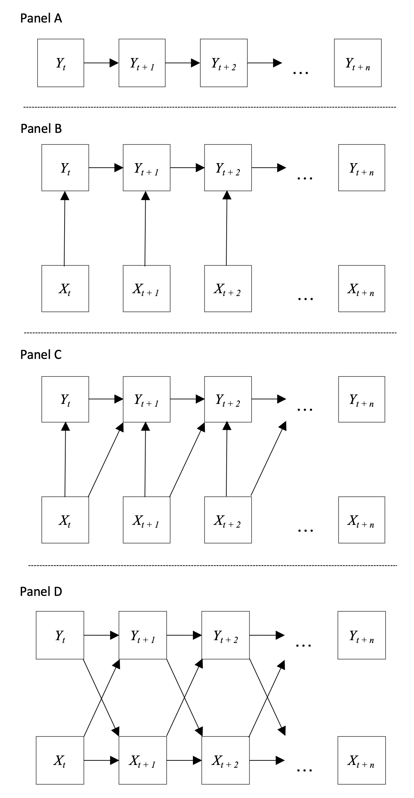

# Dynamics

Dynamics refers to a specific branch of mathematics, but the term is used in different ways throughout our literature. It is used informally to mean "change", "fluctuating," "volatile," "longitudinal," or "over time" (among others), whereas formal definitions in our literature are presented within certain contexts. Wang [-@Wang2016] defines a dynamic *model* as a "representation of a system that evolves over time. In particular it describes how the system evolves from a given state at time *t* to another state at time *t + 1* as governed by the transition rules and potential external inputs" (p. 242). @vancouver_translating_2018 state that dynamic *variables* "behave as if they have memory; that is, their value at any one time depends somewhat on their previous value" (p. 604). Finally, @monge_theoretical_1990 suggests that in dynamic *analyses*, "it is essential to know how variables depend upon their own past history" (p. 409). In this section we discuss a number of inferences couched in the idea that the past constrains future behavior. 

Does performance relate to itself over time? Do current helping behaviors depend on prior helping behaviors? Does unit climate demonstrate self-similarity across time? Does income now predict income in the future? These are questions about the relationship of a single variable with itself over time -- does it predict itself at each subsequent moment? Is it constrained by where it was in the past?

Panel A of Figure \ref{dynamics_figure} shows the concept with a box and arrow diagram. $y$ predicts itself across every moment -- it has self-similarity and its value now is constrained by where it was a moment ago. In our diagram we show that $y$ at time $t$ is related to $y$ at time $t + 1$. In other words, we posit that $y$ shows a lag-one relationship, where $y$ is related to its future value one time step away. Researchers are of course free to suggest any lag amount that they believe captures the actual relationship. 

>> **Inference 1:** On average across the sample there is self-similarity in $y$; $y$ relates to itself across time. 


\begin{center}

------------

Insert Figure \ref{dynamics_figure} about here

------------

\end{center}

The next inference is about relating a predictor to our response variable while it still retains memory. Panel B of Figure \ref{dynamics_figure} shows this second dynamic inference. $y$ still shows self-similarity across time but it is now predicted by concurrent values of $x$. When current values of $x$ are associated with $y$ while accounting for memory -- i.e., partialling prior values of $y$ -- researchers typically call the association "change." How does affect relate to change in performance? Does depletion covary with change in OCBs? Accounting for prior $y$ means that we are assessing the relationship between concurrent $x$ and the difference between where $y$ was and where it is now. 

>> **Inference 2:** On average across the sample concurrent $x$ relates to the change in $y$ across time.

It is also possible to assess lag relationships of change. Panel C of Figure \ref{dynamics_figure} shows concurrent relationships as we saw above but it also includes lags from the predictor to the outcome. $y$ retains memory, but it is predicted by both concurrent and prior values of $x$.

>> **Inference 3:** On average across the sample there is a cross-lag relationship of change, where one variable relates to the change of another at a different point in time.

Inferences one through three can also be paired with additional questions about variability across the sample. Perhaps we expect there to be variability in $y$'s self-similarity, or variability in the relationship between concurrent $x$ and change in $y$. 

## Extensions

We described a simple set of inferences above, but the ideas generalize to more complex dynamics as well. Often researchers are interested in reciprocal relationships, where $x$ influences subsequent $y$, which then goes back to influence $x$ at the next time point. Said formally, $x_t$ influences $y_{t+1}$, which then influences $x_{t+2}$. Said informally, current performance influences subsequent self-efficacy, which then influences performance on the next trial. These inferences are no different than what we saw above -- they are cross-lag predictions -- all we did was add more of them. Panel D of figure \ref{dynamics_figure} shows reciprocal dynamics, where both $x$ and $y$ show self-similarity and cross-lag relationships with one another. 

Researchers typically posit a sequence of single cross-lag predictions when they are interested in reciprocal dynamics. For example, @hardy2018 explored reciprocal relationships among performance and motivation (self-efficacy, metacognition, and exploratory behavior). They present a sequence of hypotheses including (1) prior self-efficacy negatively relates to subsequent exploratory behavior and (2) prior exploratory behavior positively relates to subsequent self-efficacy (among others). These single inferences are used in aggregate to make conclusions about reciprocal influence.

The dynamic inferences shown here also generalize to systems of variables where a researcher posits self-similarity and cross-lag predictions across many variables. There could be reciprocal dynamics between a set of variables like performance, self-efficacy, and affect, or a sequence of influence between dyadic exchanges, performance, and team perceptions: perhaps initial dyadic exchanges influence subsequent team perceptions, which later influence performance. Following the performance change, the structure of the task updates and this initiates new dyadic exchanges. Once a researcher grasps the foundational ideas presented here he or she is free to explore any number of complex relationships.

Also notice that complex dynamics subsume the concept of mediation. It is of course an important idea, but when we focus on systems of variables and reciprocal dynamics we place our emphasis elsewhere. If readers are interested in mediation we urge them to read one of the many great papers on it [@stone2008relative; @maxwell2007bias; @maxwell2011bias]. 

## Models

There are a number of recent papers on dynamic modeling that cover the inferences discussed in this section. @Wang2016 reviews many different types of dynamic models and, although his paper will not provide readers will specific code it is an excellent starting paper to observe the variety of models available. When a researcher wants to explore dynamic inferences with respect to a single unit over time they will be examining time-series data, and there are a number of models for this application. @deshon_multivariate_2012 discusses autoregressive distributed lag (ARDL) and vector autoregressive models, and Jebb and collegues [-@jebb_introduction_2017; -@jebb_time_2015] introduce ARDL and autoregressive distributed moving average (ARIMA) models. Finally, Xu and DeShon (almost) discuss a dynamic model first introduced by @bollen_general_2010. This dynamic panel model is appropriate for researchers who want to model dynamics across more than one unit. Moreover, it is better suited than HLM for typical situations in organizational psychology and management (i.e., short $t$ and large $N$). 


```{r, echo = F, eval = F}
library(xtable)
library(knitr)
library(kableExtra)
library(tidyverse)

inference_text3 <- c('There is autoregression in $x$.',
                    'There is a cross-lag relationship, where one variable relates to another at a different point in time. x_t is associated with y_t+1 across time.',
                    'There is a change relationship, where one variable relates to the change in another. x_t is associated with delta y_t.',
                    'There is a cross-lag relationship of change, where one variable relates to the change of another at a different point in time. x_t is associated with change at y_t+1.')
dy_table <- data.frame(
  Inference = c(1, 2, 3, 4),
  Examples = c(linebreak('Burnout demonstrates self-similarity across time.\nPerformance relates to subsequent performance.'),
                 linebreak('Affect predicts subsequent counterproductive work behaviors.\nTurnover relates to subsequent firm performance.'),
                 linebreak('Positive health status relates to change in happiness.\nAnxiety relates to change in performance.'),
                 linebreak('Affect relates to subsequent change in performance.\nHelping behaviors predict subsequent depletion changes.'))
)

dy_table %>%
  kable('latex', booktabs = T, escape = F, align = 'l', caption = '\\label{dynamics_table}Examples of dynamic inferences.') %>%
    column_spec(1, width = '5em') %>%
    column_spec(2, width = '30em') %>%
  row_spec(1:3, hline_after = T)


```


```{r, echo = F, fig.cap = 'Univariate and bivariate dynamics adapted from DeShon (2012). Panel A shows self-similarity or autoregression in $Y$ across time. Panel B shows concurrent $X$ predicting change in $Y$. Panel C shows $X$ lagged change relationships. Panel D shows reciprocal dynamics between $X$ and $Y$.\\label{dynamics_figure}', fig.height = 10, fig.align = 'center'}

library(png)
library(grid)
library(gridExtra)

#plot1 <- readPNG('figures/dynamics/d1.png')
#plot2 <- readPNG('figures/dynamics/d2.png')
#dall <- readPNG('figures/dynamics/dall.png')

#grid.arrange(rasterGrob(dall))

library(knitr)


```


