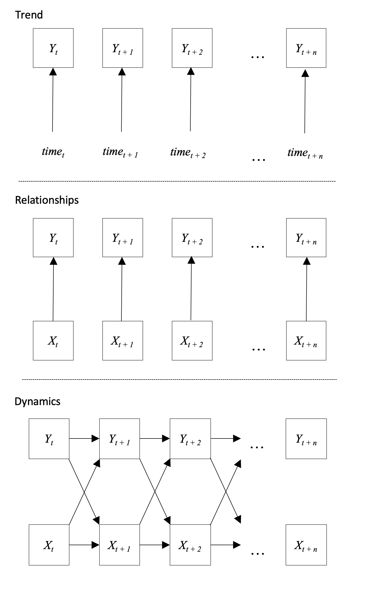

Organizational scientists recognize that psychological phenomena and processes unfold over time [@beal_esm_2015; @pitariu_explaining_2010]. Individuals in the workplace, over time, strive to accomplish work goals, team members collaborate so the whole eventually becomes greater than the sum of its parts, and managers repeatedly promote values to build vibrant, innovative work cultures. To better understand psychological phenomena, such as motivation, teamwork, and organizaitonal culture, researchers must attent not to static snapshots of behavior  [@ilgen_computational_2000; @kozlowski_advancing_2013; @kozlowski_capturing_2016] but to variables and relationships as they move through time. They must observe or obtain longitudinal data capturing the unfolding set of events, interactions, behaviors, cognitions, or affective reactions responsible for psychological phenomena. Fortunately, available technology and data repositories makes it easier to collect or obtain longitudinal data than previously possible. 

Researchers may explore a variety of inferences when they analyze longitudinal data. In particular, researchers may examine the shape of trajectories on psychological constructs (e.g., did job satisfaction generally increase or decrease over six months after a merger?), how two or more constructs relate to each other (e.g., did team communications and cohesion positively correlate over time?), or whether changes in one variable relate to changes in another [e.g., did changes in goal-setting lead to changes in employee performance?; @dunford_is_2012; @hardy_interrelationships_2018; @jones_baby_2016; @judge_what_2014; @lanaj_when_2016; @rosen_who_2016; @scott_multilevel_2011]. Given the variety of inferences researchers may explore with longitudinal data, an organizing framework would elucidate their subtle differences, enhance theoretical insight, guide data collection, and facilitate sound analytical work. 

We developed a framework to capture these inferences, a way to organize the fundamental patterns researchers explore with longitudinal data despote focusing on different content areas or using different statistical models. Researchers often focus on one famililiar inference despite having the data to explore many more fundamental patterns. We bring attention to the span of questions available so that researchers can fully appreciate and take advantage of their data. Moreover, there are many complex statistical models lingering in our literature and it is not always clear for which questions they are appropriate. We provide readers with potential models for each inference so that they can be sure that the model they evoke is appropriate for the reseearch question that they are interested in. In summary, this paper exposes researchers to the span of inferences they may investigate when they collect longitudinal data, links those inferences to statistical models, and explains differences between various longitudinal inferences.

# Longitudinal Research in Psychology

This paper is devoted to inferences with repeated measures, so we begin with a few labels and definitions. Authors typically identify a "longitudinal" study by contrasting either (a) research designs or (b) data structures. Longitudinal *research* is different from cross-sectional research because longitudinal designs entail three or more repeated observations [@ployhart_longitudinal_2010]. We therefore emphasize differences on the number of observations when we distinguish longitudinal from other types of research. Longitudinal *data* are repeated observations on several units (i.e., $N$ or $i$ > 1), whereas time-series data are observations of one unit over time -- a distinction that focuses on the amount of people in the study (given repeated measures). Most organizational studies collect data on more than one unit, therefore our discussion below focuses on longitudinal research with longitudinal data, or designs with $N$ > 1, $t$ >= 3, and the same construct(s) measured on each $i$ at each $t$. That is, we focus on designs with repeated measures across many people (units) where every variable is measured at each time point. 

Longitudinal applies to both short and long-term research. An experiment with ten trials is longitudinal, as is a study spanning 10 years that assesses its measures once every year. Longitudinal is not reserved for "long-term" studies that last more than one year irrespective of the frequency of their observations. Rather, certain processes unfold over short time horizons (e.g., decision-making on simple tasks) whereas other psychological phenomena unfold over long time horizons [e.g., team performance on complex tasks; @mitchell_building_2001], so the informativeness of a particular study depends on its rationale, research design, analytical work, and effective interpretation of results as with any study. When it comes to longitudinal research in psychology, short and long time horizons both offer valuable insights.

# Framework for Longitudinal Inferences

We use three inference categories to partition our discussion, including trends, relationships, and dynamics. Briefly, longitudinal inferences focusing on trends assess whether trajectories follow a linear or curvilinear pattern or whether trends differ between-units; longitudinal inferences focusing on relationships between constructs assess the extent to which two or more constructs associate with one another between-units; longitudinal inferences focusing on dynamics in constructs assess how one or more constructs evolve as functions of themselves and each other. Each category comes with box-and-arrow model heuristics that represent the broad inferences, research questions to orient the reader as to what the sub-inferences within each section capture, and a discussion of statistical models. 

Although we use box-and-arrow diagrams throughout to represent the broad inferences, we also graph a few of the more challenging inferences with mock data -- some of the inferences in the trend and relationships sections are difficult to grasp without seeing them in data form. Keep in mind, however, that data are always messy. It is rare to find data where the inferences simply expose themselves simply by plotting -- althought it is certainly possilbe. We use these "data plots" to clearly convey what the inferences mean, but be aware that field data are often noisy. 

Finally, despite pointing researchers to statistical models, our paper puts a majority of its emphasis on inferences, therefore researchers need to be sure that they appreciate all of the nuance before applying a recommended statistical model. Numerous statistical issues arise when modeling longitudinal data, such as stationarity [see @braun2013spurious; @kuljanin2011cautionary], and the statistical models differ in how they handle these issues, the assumptions they make, and the data format they require. We do not speak directly to those issues here, but we refer readers to a number of informative references for each statistical model. 


```{r, echo = F, fig.cap = 'Common inference categories with models applied to longitudinal data.\\label{framework_figure}', fig.height = 10, fig.align = 'center'}

library(png)
library(grid)
library(gridExtra)

#plot1 <- readPNG('figures/dynamics/d1.png')
#plot2 <- readPNG('figures/dynamics/d2.png')
#dall <- readPNG('figures/dynamics/dall.png')

#grid.arrange(rasterGrob(dall))

library(knitr)


```

